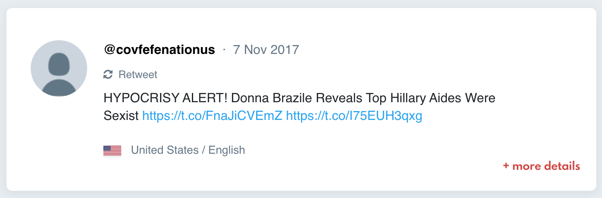
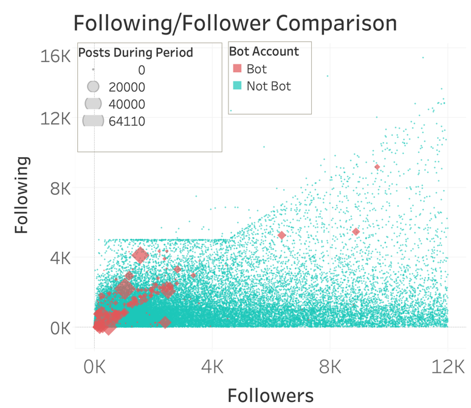
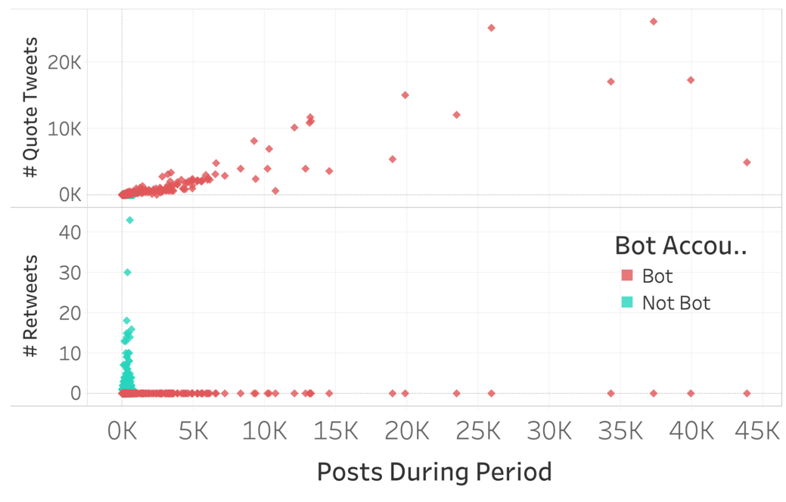
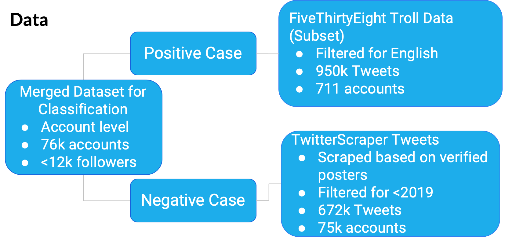
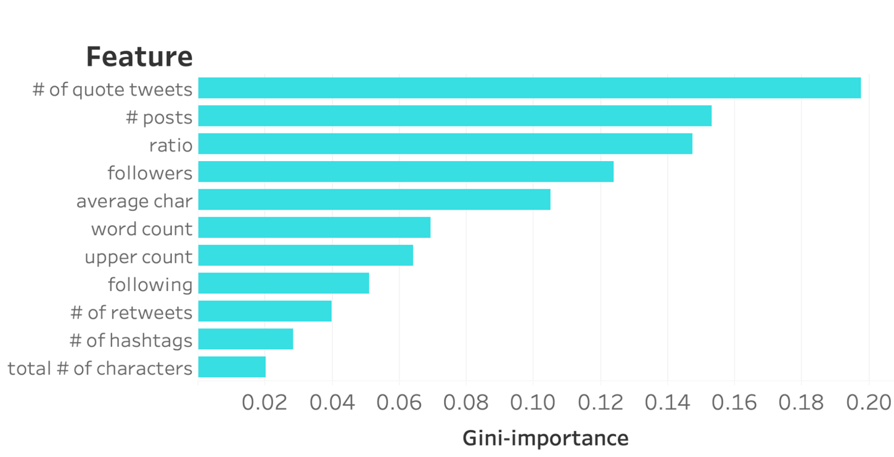

# Still a work in progress!
# Russian Twitter Troll Classification

# Summary

## Purpose
* Classification of troll accounts at either account level or individual tweet level

## Technologies Used:
* [TwitterScraper](https://github.com/taspinar/twitterscraper/blob/master/twitterscraper/query.py "TwitterScraper") (Data scraping)
* Tableau (Visualization)
* CountVectorizer and Tfidif Vectorizer (Text Features)
* scikit-learn (Modeling)
* XGBoost (Modeling)

## Data Sources
* Positive Case: [FiveThirtyEight Twitter bot data](https://github.com/fivethirtyeight/russian-troll-tweets/ "FiveThirtyEight")
* Negative Case: [Scraped tweets from verified users in 2018](https://medium.com/@bansalsamarth/this-espn-analyst-comes-closest-to-what-the-median-twitter-verified-user-looks-like-c1818aafc6e7 "median-twitter-user")

# Motivation/Objective
The Russian Internet Research Agency (IRA) deployed "troll" Twitter accounts to misinform the American populace and cause political divides. FiveThirtyEight released 3 million verified tweets from these troll accounts from 2848 accounts for research. These accounts are fully capable of disguising as real accounts as they have a substantial amount of followers and follow other users, retweet Tweets, comment on Tweets, etc. Some troll accounts pose as legitimate news sources and link fake news articles that could miscontrue the truth when a user glances through their social media. Being able to quickly classify these fake accounts from real accounts and accurately removing them before they cause more damage and discord is a pertinent goal for social media sites like Twitter.

# The Data
The content of the tweets are not necessarily the same amongst troll accounts either; FiveThirtyEight was able to identify four types of bot accounts: right-wing, left-wing, newsfeed, fearmongerers, and gamer accounts. I removed non-English tweets to standardize the positive and negative case for comparison. I scraped verified users from 2018 from this [article](https://medium.com/@bansalsamarth/this-espn-analyst-comes-closest-to-what-the-median-twitter-verified-user-looks-like-c1818aafc6e7 "median-twitter-user") of a variety of backgrounds (not necessarily only political) in order to best approximate what a standard Twitter feed would look like to the average user. Not only that, but the dataset was posted around the time the Russian troll dataset was released, making the comparison in terms of topics of the tweets more comparable to the nagative case. From the user handles in this dataset, I was able to pull past tweets from these users with information such as post date, retweets, links, etc and filtered the data to be a similar timeframes as the bot tweets to best approximate what a standard Twitter feed would entail.

When comparing the troll accounts to the verified users, trolls have several distinct behaviors. Troll accounts have an unusually high number of posts and have an unusual amount of accounts that they follow. It is uncommon for an average user who uses Twitter for light social media usage to follow so many accounts and tweet so frequently. These accounts are part of networks of bots that rapidly follow each other, as well as like and share each other's tweets. Also in the dataset, troll accounts have a tendency to quote tweet, which is a retweet with one's own input added. These bots quote tweet on legitimate account tweets to bring attention to their own content and fake news sources. 

# Classifcation Algorithms
After resolving the different structure of the positive and negative datasets, I was able to merge the two datasets into one to construct models on. One pertinent question was whether to classify the account as a whole or by individual tweets that would "flag" the account. Overall, the aforementioned behaviors of the bots such as the unusual amount of posts and number of followers proved to be useful features. Therefore, the observations were aggregated to the account level by user handle. Key features were: average followers, average following, number of retweets, number of quote tweets, and all words used in all tweets by that user. 

The text was cleaned and removed of any punctuation for analysis. A term frequency-inverse document frequency (tf-idf) vectorizer, which accounts for the number of times a word was used in the tweet against how many times that word was used as a whole, was used on the text to generated additional features.

Logistic regression, random forest, and boosted gradient tree models were trained on a 80% train set. Recall and precision are both important metrics to evaluate our model on; we want to classify as many bots as possible, but we do not want to ban any legitimate accounts, which may alienate the actual users of the platform. Therefore the F1 score, the harmonic mean of precision and recall, was used as a key metric for the classification models. XGBoost performed the best of the models with near perfect scores. This immediately raised a red flag, indicating that there are specific traits of the dataset (in this case, specifically the terms used by the bots) that the model was able to perfectly predict on. Such a model would not be able to generalize on new data, which would defeat the purpose of a classifier.

Ultimately, I opted to remove the text features from the classifier. This allows the model to be more generalizable on important general features regarding new accounts. Removing the text features dropped the recall and precision of the model, but the model could still accurately predict a majority of the bots. 

# Conclusions 
The best usage of such a classifer would be to flag suspicious accounts for human inspection instead of automatically banning them. While this is much slower to respond, in the context of Twitter, it is more just to err on the side of caution and prevent Type 1 errors. A more precise and generalizable algorithm is necessary for automatic removal of accounts. In order to  incorporate the text features (that would improve all accuracy metrics), more data with text similar to that of the bots would need to be collected for the positive case.
